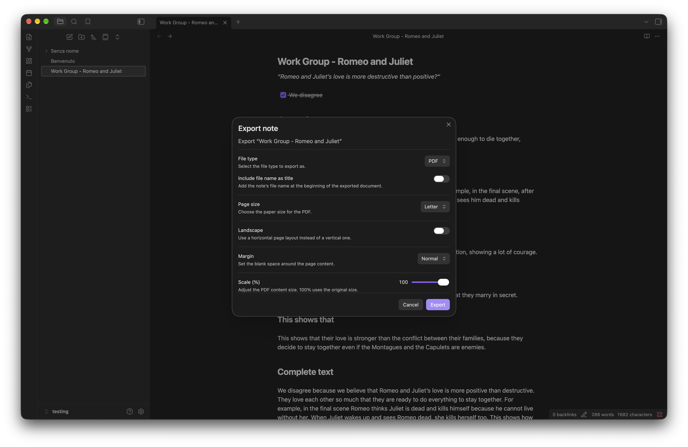
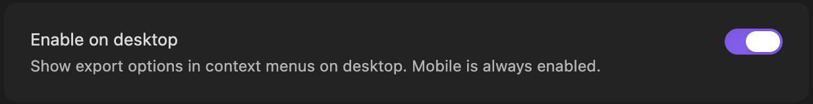

# Mobile Export

Export your Obsidian notes to **PDF** or **HTML**, directly from mobile. Mobile Export creates clean documents that are easy to share, print, or open outside Obsidian.

## Usage

Open the context menu for a note or inside the editor and select **Export**.
Choose between PDF and HTML. PDF exports can be customized with page size, orientation, margins, text size, and an optional title.

## Offline support and external assets

PDF export requires a small additional component that is downloaded from **jsDelivr** the first time you use it.
After that, PDF export works offline. Your notes are never uploaded or sent to any external service.

_The component in question is [Takumi PDF for browser use (WASM)](https://takumi.kane.tw/docs/pdf#in-the-browser), the current downloaded version is `0.15.0`_

## Desktop

Mobile Export also works on desktop. If you only want to use it on mobile, you can disable desktop support from **Settings → Community plugins → Mobile Export**.

## Language Support

Mobile Export supports all languages that are supported by Obsidian. Please report any issues with your language to the [GitHub repository](https://github.com/clemenzi/obsidian-mobile-export/issues).

## License

See [LICENSE](./LICENSE).
